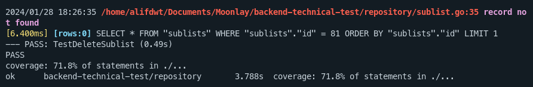

<h1 align="center">Moonlay Academy - Technical Test</h1>

> **Todo List App**
> This is To-Do List manager, built using the [Go programming language](https://golang.org), the [Echo](https://echo.labstack.com) web framework, and the [Gorm ORM](https://gorm.io) for interacting with a [PostgreSQL](https://www.postgresql.org) database. It allows users to manage their tasks by creating, updating, deleting, and retrieving lists and sublists.

## 🧰 Installation

1. Clone the repository

```bash
git clone https://github.com/alifdwt/moonlay-backend-technical-test.git
```

2. Install Dependencies

```bash
cd moonlay-backend-technical-test
go mod tidy
```

3. Add your .env file

```sh
DB_CONNECTION=pgsql
DB_HOST=localhost
DB_PORT=5432
DB_NAME=todo_db
DB_DATABASE_TEST=todo_db_test
DB_USERNAME=root
DB_PASSWORD=secret

APP_TIMEZONE='Asia/Jakarta'
```

4. Start the server

```bash
go run main.go
```

5. By default, the server is running on port 5000. Access the server at http://localhost:5000/api/v1

## 📖 Documentation

You also can go to http://localhost:5000/swagger/index.html to see the documentation

### Rest API Documentation

#### Get Lists

- Method: GET
- Path: /lists
- Parameters:
  - Query: page
  - Query: search
  - Query: withSublists
- Response: JSON

#### Get List by ID

- Method: GET
- Path: /lists/{id}
- Parameters:
  - Path: id
- Response: JSON

#### Create List

- Method: POST
- Path: /lists
- Parameters: JSON
- Response: JSON

#### Update List

- Method: PUT
- Path: /lists/{id}
- Parameters:
  - Path: id
  - Body: JSON
- Response: JSON

#### Delete List

- Method: DELETE
- Path: /lists/{id}
- Parameters:
  - Path: id
- Response: JSON

---

#### Get Sublists

- Method: GET
- Path: /sublists
- Parameters:
  - Query: page
  - Query: search
- Response: JSON

#### Get Sublist by ID

- Method: GET
- Path: /lists/{id}
- Parameters:
  - Path: id
- Response: JSON

#### Get Sublist by List ID

- Method: GET
- Path: /sublists/list/{listId}
- Parameters:
  - Path: listId
  - Query: page
  - Query: search
- Response: JSON

#### Create Sublist

- Method: POST
- Path: /lists
- Parameters:
  - Body: JSON
- Response: JSON

#### Update Sublist

- Method: PUT
- Path: /lists/{id}
- Parameters:
  - Path: id
  - Body: JSON
- Response: JSON

#### Delete Sublist

- Method: DELETE
- Path: /lists/{id}
- Parameters:
  - Path: id
- Response: JSON

## 📖 Usage

<p align="center">
    
</p>

## 👨‍💻 About Me

- Github: [Alif Dewantara](https://github.com/alifdwt)
- LinkedIn: [Alif Dewantara](https://www.linkedin.com/in/alifdwt)
